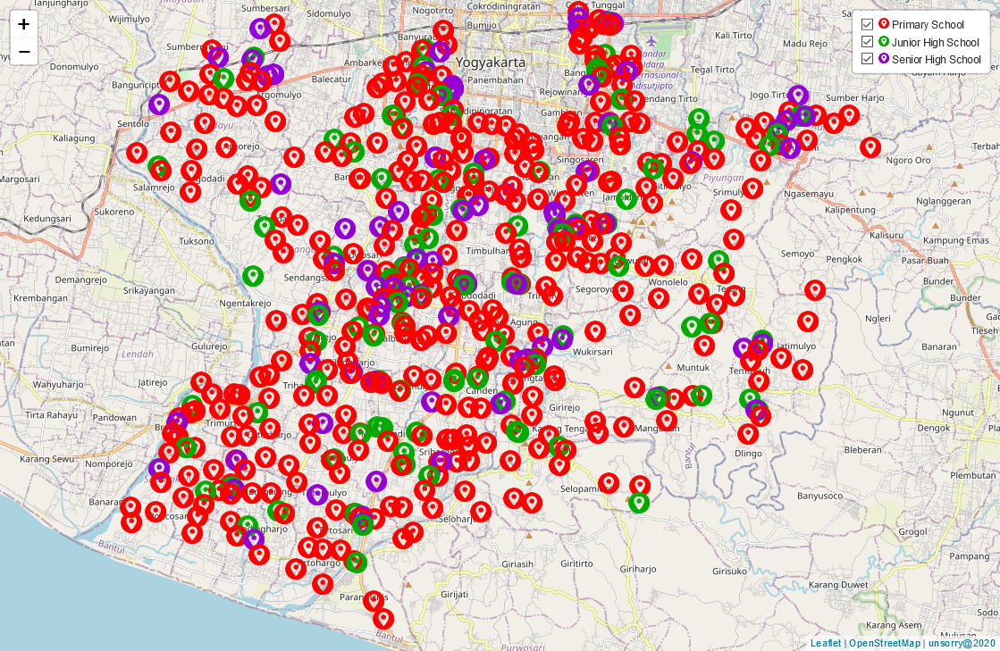

# leaflet-marker-category

##

Displays markers with different icons by category

---
**DEMO**

> Symbol/Icon Array: [https://anshori.github.io/leaflet-marker-category/symbol-array](https://anshori.github.io/leaflet-marker-category/symbol-array)

> Filter: [https://anshori.github.io/leaflet-marker-category/filter](https://anshori.github.io/leaflet-marker-category/filter)

---

`
unsorry@2020
`